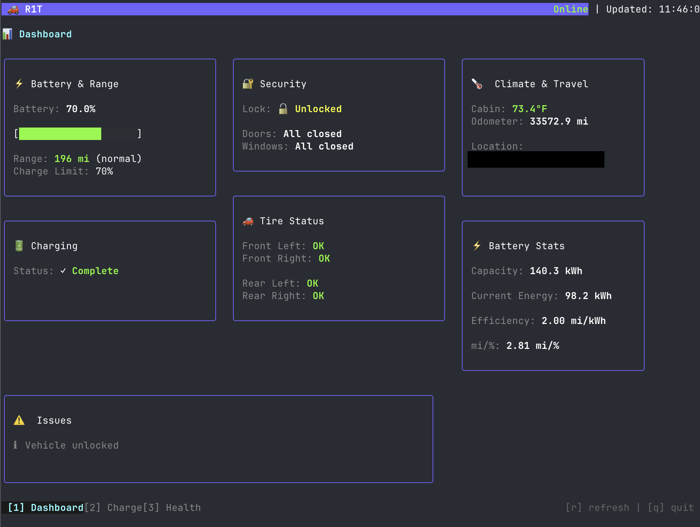
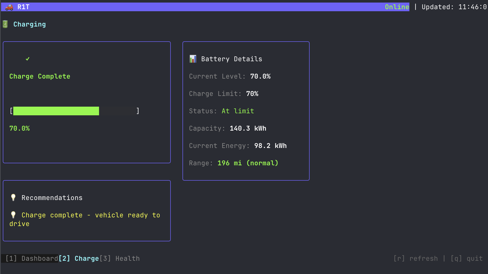
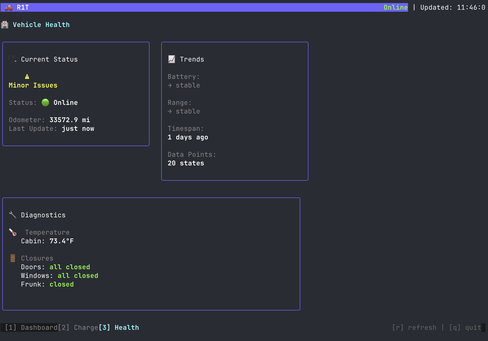

# rivian-ls

A production-quality terminal UI (TUI) and headless CLI tool for monitoring Rivian vehicle telemetry in real-time.

> ⚠️ **WARNING**: This tool uses an **unofficial** Rivian API that is not publicly documented or supported. Using this tool may violate Rivian's Terms of Service. Use at your own risk. The API may change or break at any time without notice.

## Features

- 🚗 **Real-time vehicle monitoring** via GraphQL + WebSocket subscriptions
- 📊 **Interactive TUI** powered by Bubble Tea with multiple views
- 🚙 **Multi-vehicle support** with interactive selection menu
- 📈 **Historical charts** with ASCII sparklines for all metrics
- 🤖 **Headless CLI mode** for scripting and automation
- 💾 **Local persistence** for historical data and analysis
- 🔐 **Secure credential storage** with OS keychain integration
- 📉 **Derived insights**: charging narratives, readiness score, efficiency tracking
- ⚙️ **Flexible configuration** via config file, environment variables, or CLI flags
- 🔄 **Auto-fallback** from WebSocket to HTTP polling when needed

### What's New in v0.3.0

- **Multi-Vehicle Support**: Interactive vehicle selection menu (`v` key)
  - Switch between vehicles at runtime without restarting
  - Shows battery %, online status, and vehicle details
  - Keyboard navigation with arrows or number keys
- **Historical Charts**: New 4th view with ASCII sparklines
  - Battery Level, Range, Charging Rate, Temperature, Efficiency
  - Configurable time ranges (24h, 7d, 30d)
  - Statistics display (current, min, max, change)
  - Left/Right arrows to switch metrics, `t` to cycle time ranges
- **Bug Fix**: Honors `--vehicle` flag for initial vehicle selection

### What's New in v0.2.0

- **Config File Support**: Create `~/.config/rivian-ls/config.yaml` to set defaults
- **Environment Variables**: Configure via `RIVIAN_EMAIL`, `RIVIAN_VERBOSE`, etc.
- **New Flags**: `--quiet`, `--verbose`, `--no-store` for better control
- **Standardized Exit Codes**: Proper exit codes (0-4) for shell scripting
- **Configuration Layering**: CLI flags > env vars > config file > defaults

## Screenshots

### Dashboard View
Real-time overview of battery, charging, security, tire status, and calculated metrics.



### Charge View
Detailed charging information with battery details and intelligent recommendations.



### Health View
Vehicle diagnostics, trends over time, and closure status monitoring.



## Installation

### Homebrew (Recommended)

```bash
brew install pfrederiksen/tap/rivian-ls
```

### Download Binary

Download the latest release for your platform from the [Releases page](https://github.com/pfrederiksen/rivian-ls/releases).

### From Source

**Prerequisites:**
- Go 1.21 or later
- A Rivian account with at least one vehicle

```bash
git clone https://github.com/pfrederiksen/rivian-ls.git
cd rivian-ls
make build
```

The binary will be built as `./rivian-ls`.

## Quick Start

### TUI Mode (Interactive Dashboard)

Launch the interactive terminal UI:

```bash
rivian-ls
```

You'll be prompted for your email and password on first run. If MFA/OTP is enabled, you'll be asked for the code. Credentials are cached securely for future runs.

**Navigation:**
- Press `1`, `2`, `3`, or `4` (or `d`, `c`, `h`) to switch between views
- Press `v` to open vehicle selection menu (multi-vehicle accounts)
- Press `r` to manually refresh data
- Press `q` or `Ctrl+C` to quit

**Views:**
1. **Dashboard** (`1` or `d`): Battery, range, charging status, locks, closures, cabin temp, tire pressures, ready score
2. **Charge** (`2` or `c`): Detailed charging session info and history
3. **Health** (`3` or `h`): Tire pressure trends and vehicle timeline
4. **Charts** (`4`): Historical trends with ASCII sparklines
   - Battery Level (%)
   - Range Estimate (mi)
   - Charging Rate (kW)
   - Cabin Temperature (°F)
   - Energy Efficiency (mi/kWh)
   - Press `←`/`→` to switch metrics
   - Press `t` to cycle time ranges (24h → 7d → 30d)

### CLI Mode (Headless/Scripting)

The CLI mode is designed for scripting, automation, and piping data to other tools.

#### Get a snapshot

```bash
# Human-readable text output (default)
rivian-ls status

# JSON output for scripting
rivian-ls status --format json --pretty

# YAML output
rivian-ls status --format yaml --pretty

# CSV output
rivian-ls status --format csv

# Table output
rivian-ls status --format table
```

#### Stream live updates

```bash
# Stream updates continuously (WebSocket with auto-fallback to polling)
rivian-ls watch

# JSON output
rivian-ls watch --format json --pretty

# Force polling mode with 30-second interval
rivian-ls watch --interval 30s

# Note: WebSocket may fail due to Rivian API limitations - the tool automatically
# falls back to HTTP polling mode (30s interval) when this happens
```

#### Export historical data

```bash
# Export all cached history as JSON
rivian-ls export --format json --pretty > vehicle-history.json

# Export last 100 records as CSV
rivian-ls export --limit 100 --format csv > history.csv

# Export data from the last 24 hours
rivian-ls export --since 24h --format yaml > last-24h.yaml
```

#### Common Options

- `--email <email>`: Specify email (prompts if not provided)
- `--password <password>`: Specify password (prompts securely if not provided)
- `--vehicle <index>`: Select vehicle by index (0-based, default: 0)
- `--db <path>`: Custom database path (default: `~/.local/share/rivian-ls/state.db`)
- `--format <format>`: Output format for CLI commands (`text`, `json`, `yaml`, `csv`, `table`)
- `--pretty`: Pretty-print JSON/YAML output
- `--interval <duration>`: Polling interval for watch mode (e.g., `30s`, `1m`)
- `--offline`: Use cached data only (for `status` command)

#### Exit Codes

- `0`: Success
- `1`: Authentication failure (invalid credentials, OTP failed)
- `2`: Vehicle not found (no vehicles registered, invalid vehicle index)
- `3`: API error (network failure, Rivian API unavailable)
- `4`: Invalid arguments (bad flags, conflicting options, config errors)

## Configuration

Configuration can be provided via multiple sources. Priority order (highest to lowest):
1. Command-line flags
2. Environment variables
3. Config file (`~/.config/rivian-ls/config.yaml`)
4. Defaults

### Config File

Create `~/.config/rivian-ls/config.yaml`:

```yaml
# Authentication (optional - will prompt if not provided)
email: your.email@example.com
# password: leave empty - prompting is more secure

# Storage
db_path: ~/.local/share/rivian-ls/state.db
disable_store: false  # Set to true to prevent saving state history

# Vehicle selection
vehicle: 0  # 0-based index if you have multiple vehicles

# Polling interval for watch mode
poll_interval: 30s

# Output verbosity
quiet: false    # Suppress informational messages
verbose: false  # Enable debug logging
```

See [`config.yaml.example`](config.yaml.example) for a complete example.

### Environment Variables

All config file options can be set via environment variables:

```bash
export RIVIAN_EMAIL="your.email@example.com"
export RIVIAN_PASSWORD="your-password"  # Not recommended - use prompt instead
export RIVIAN_DB_PATH="/custom/path/to/state.db"
export RIVIAN_TOKEN_CACHE="/custom/path/to/credentials.json"
export RIVIAN_DISABLE_STORE="true"
export RIVIAN_POLL_INTERVAL="30s"
export RIVIAN_QUIET="true"
export RIVIAN_VERBOSE="true"
```

### Credential Storage

Credentials are cached in `~/.local/share/rivian-ls/credentials.json`. The cache includes:
- Email address
- Access token and refresh token
- Token expiration times

On subsequent runs, the tool will automatically use cached credentials. If tokens are expired, they'll be refreshed automatically. If refresh fails, you'll be prompted to log in again.

### Multi-Vehicle Support

**TUI Mode (Interactive):**
- Press `v` to open the vehicle selection menu
- Navigate with arrow keys or numbers (1-9)
- Press Enter to confirm selection, Esc to cancel
- Switch vehicles at runtime without restarting

**CLI Mode (Headless):**
Use `--vehicle <index>` to select which vehicle on startup:

```bash
# Use first vehicle (default)
rivian-ls status --vehicle 0

# Use second vehicle
rivian-ls status --vehicle 1
```

## Development

See [CLAUDE.md](CLAUDE.md) for development workflow, testing, and architecture details.

## Architecture

```
rivian-ls/
├── cmd/rivian-ls/          # CLI entrypoint
├── internal/
│   ├── rivian/            # GraphQL + WebSocket client for Rivian API
│   ├── model/             # Domain models and state reducer
│   ├── tui/               # Bubble Tea TUI implementation
│   ├── cli/               # Headless CLI formatters and commands
│   └── store/             # Local snapshot persistence (SQLite/BoltDB)
├── docs/                  # Additional documentation
└── .github/workflows/     # CI/CD pipelines
```

## Security & Privacy

- **Credentials**: Never hardcoded. Stored in OS keychain when possible, encrypted at rest otherwise.
- **Tokens**: Access/refresh tokens are stored securely and refreshed automatically.
- **Data**: Vehicle telemetry snapshots are stored locally only (not sent to third parties).
- **Privacy**: Use `--no-store` flag to disable local persistence entirely.

## Troubleshooting

### Authentication fails

- Ensure your email and password are correct
- If you have MFA enabled, ensure you enter the correct OTP code
- Check that you can log in via the official Rivian mobile app

### WebSocket connection fails

- The app will automatically fall back to polling
- Check your network/firewall settings
- Try increasing `--interval` for longer polling periods

### "Vehicle not found"

- Ensure you have at least one vehicle registered in your Rivian account
- Try using `--vehicle <VIN>` to select a specific vehicle

## Contributing

Contributions are welcome! Please:

1. Fork the repository
2. Create a feature branch (`feat/...`, `fix/...`, `chore/...`)
3. Write tests for new functionality
4. Ensure `make check` passes (linting + tests + coverage threshold)
5. Update documentation as needed
6. Open a pull request against `main`

## License

MIT License - see LICENSE file for details.

## Disclaimer

This project is not affiliated with, endorsed by, or connected to Rivian Automotive, LLC. All product names, logos, and brands are property of their respective owners.
